# WarpLink

## Logical View

### Milestone 01: Core Link Shortening (Write Path)

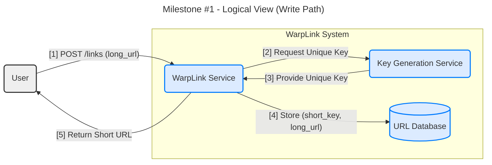

### Milestone 02: Core Link Redirection (Read Path)

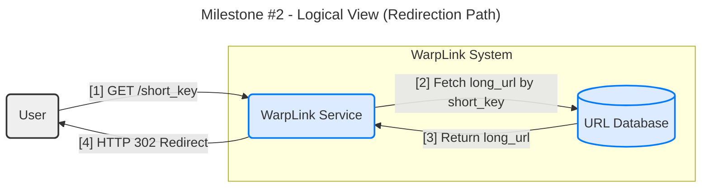

### Milestone 03: High-Performance Read Cache

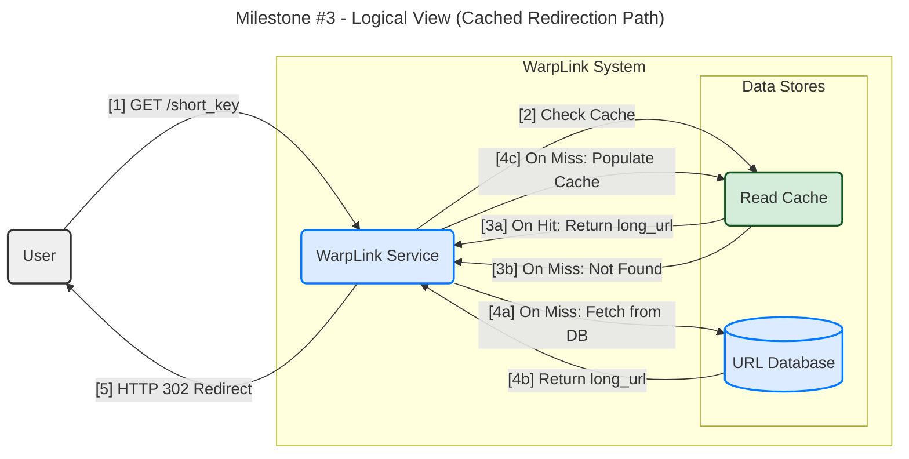

### Milestone 04: User Authentication System

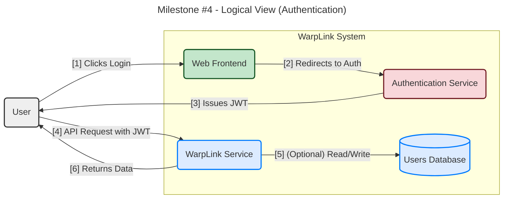

### Milestone 05: Custom Alias Creation

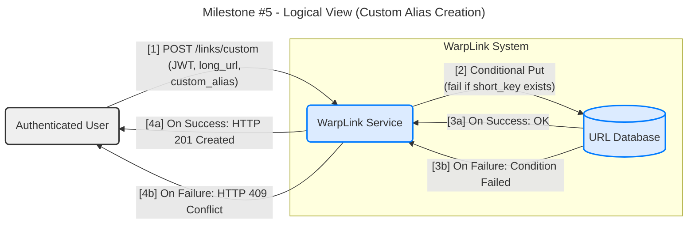

### Milestone 06: Public API & Key Authentication

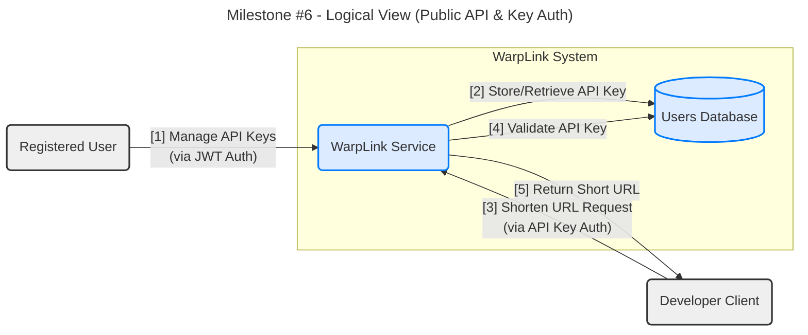

### Milestone 07: Asynchronous Analytics Event Capture

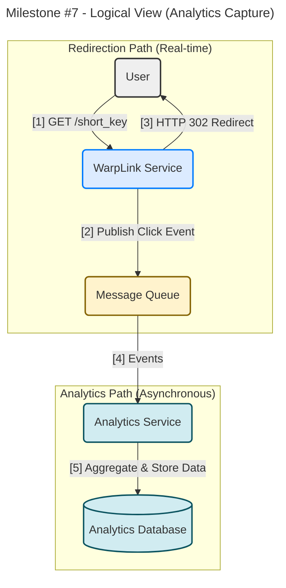

### Overall Logical View

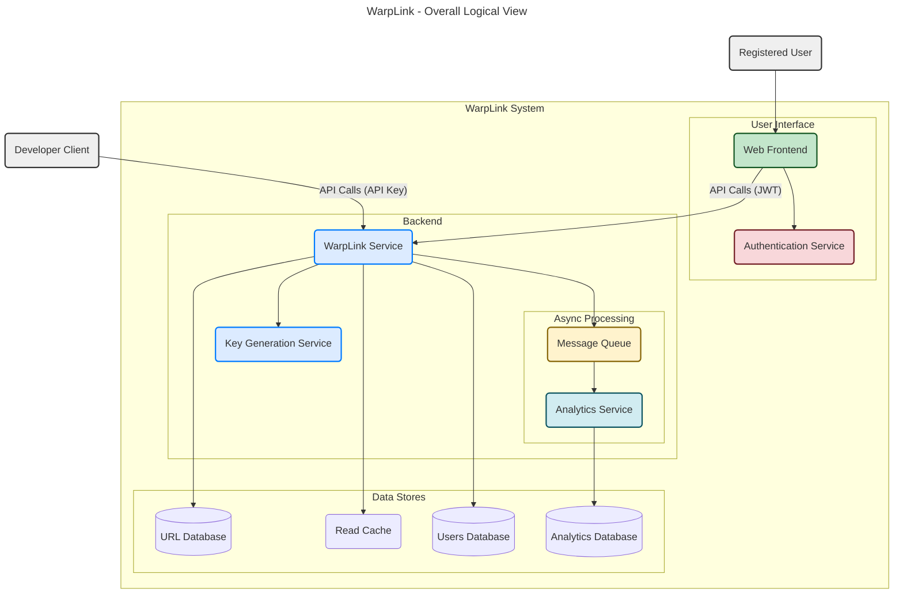

## Physical View

### Milestone 01: Core Link Shortening (Write Path)

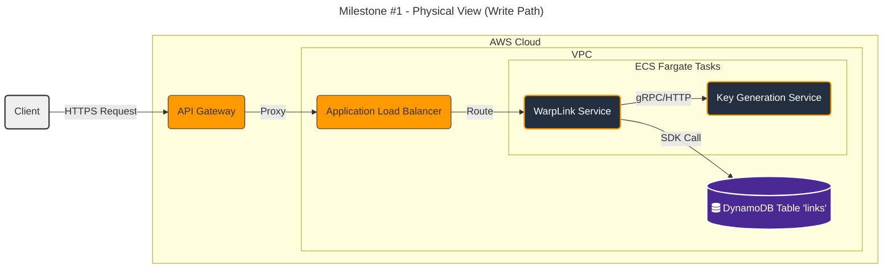

### Milestone 02: Core Link Redirection (Read Path)

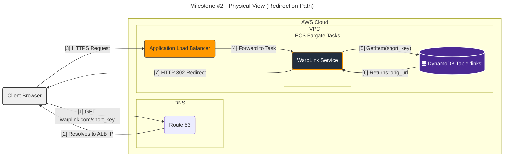

### Milestone 03: High-Performance Read Cache

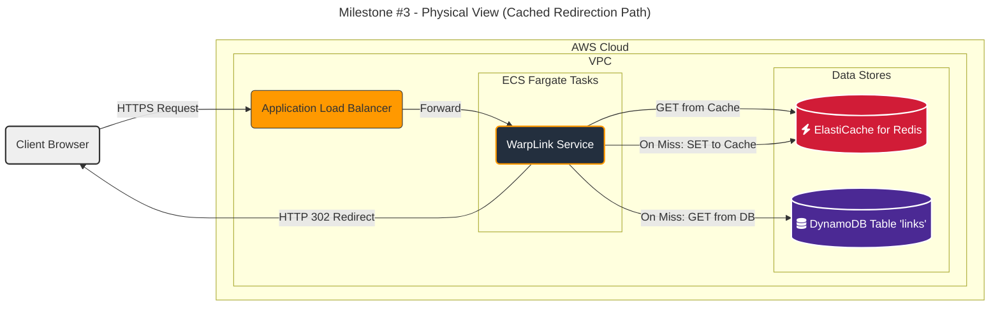

### Milestone 04: User Authentication System

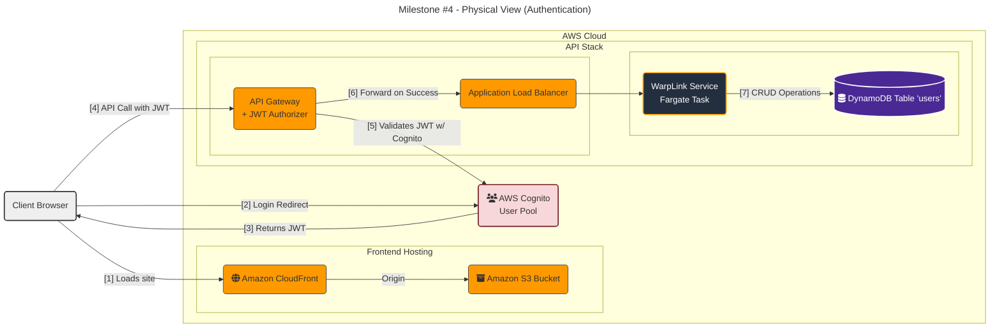

### Milestone 05: Custom Alias Creation

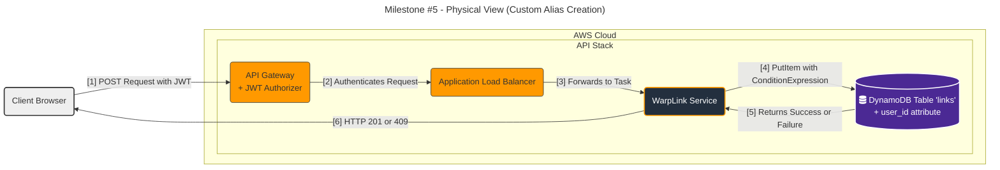

### Milestone 06: Public API & Key Authentication

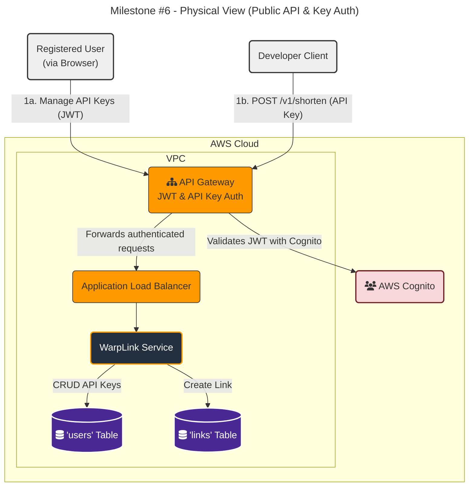

### Milestone 07: Asynchronous Analytics Event Capture

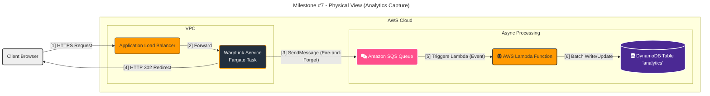

### Overall Physical View

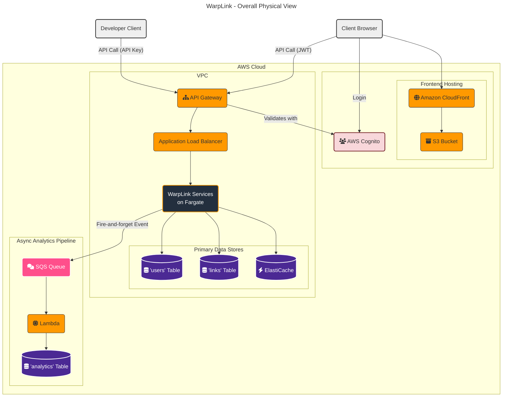
