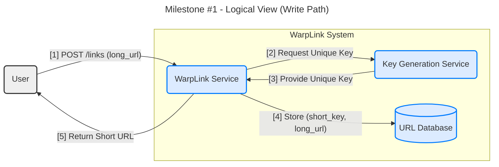
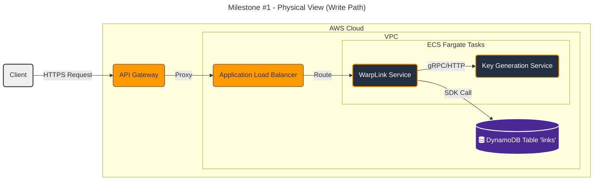

#### **Core Link Shortening (Write Path)**

**Problem:**
The system needs a reliable and scalable mechanism to handle the "write" operation, which is the core of requirement **FR1 (Short URL Generation)**. A user must be able to submit a long URL and receive a unique, short, and non-predictable key that can be used for redirection later. The design must avoid collisions (two long URLs getting the same short key) and be performant enough to handle the initial scale requirements.

**Solution:**
The proposed architecture separates the core application logic from the responsibility of key generation.

1.  An API endpoint will accept the long URL from the user.
2.  The main application service (`WarpLink Service`) will request one or more unique keys from a dedicated `Key Generation Service (KGS)`.
3.  The `WarpLink Service` will then store the mapping between the received unique key and the user's long URL in a highly-available, scalable database.
4.  The unique key (as part of the full short URL) is returned to the user.

This decoupled approach ensures that the complex task of generating unique keys at scale does not become a bottleneck for the main application.

**Trade-offs:**

*   **Decoupled Key Generation Service (KGS):**
    *   **Pros:** Highly scalable, reusable by other services, and prevents key generation logic from bogging down the main application. It allows us to pre-generate keys and cache them for extremely fast issuance.
    *   **Cons:** Introduces an additional network hop and another service to manage and maintain, increasing initial architectural complexity compared to a simple in-database counter.

*   **Database Choice (NoSQL vs. SQL):**
    *   **Pros (NoSQL - DynamoDB):** The use case is a simple key-value lookup (`short_key` -> `long_url`), which is a perfect fit for a NoSQL database like DynamoDB. It offers massive scalability, managed infrastructure, and low latency for simple lookups.
    *   **Cons (NoSQL - DynamoDB):** Less flexible for complex queries that might be needed for future analytics features. However, this can be addressed later with secondary indexes or by streaming data to a different system.

*   **Deployment (Serverless vs. Containers):**
    *   **Pros (Containers - Fargate):** Adheres to the "Container-First" principle. Provides consistent environments, avoids cold starts (which can be an issue with serverless for latency-sensitive APIs), and offers more control over the execution environment.
    *   **Cons (Containers - Fargate):** Higher operational overhead and cost at very low traffic levels compared to a serverless (Lambda) approach.

---

#### **Design the Architecture-as-Code (AaC)**

Here are the three artifacts for this milestone: the Logical View, the Physical View, and the Mapping Table.

**Artifact 1: Logical View (C4 Component Diagram)**

This diagram shows the high-level software components and their interactions for the write path.

**Artifact 2: Physical View (Deployment Diagram)**

This diagram maps the logical components to specific AWS services.

**Artifact 3: Component-to-Resource Mapping Table**

| Logical Component | Physical Resource | Rationale (Why this technology?) |
| :--- | :--- | :--- |
| **WarpLink Service** | **AWS Fargate** | A container-based approach aligns with our "Container-First" principle. Fargate is chosen for its serverless nature, removing the need to manage underlying EC2 instances while providing better performance consistency than Lambda for this use case. |
| **Key Generation Service (KGS)** | **AWS Fargate** | Co-locating with the `WarpLink Service` on the same platform simplifies the operational model. Fargate provides the necessary compute resources for this critical, high-throughput internal service. |
| **URL Database** | **Amazon DynamoDB** | The core data model is a simple key-value pair (`short_key` -> `long_url`). DynamoDB is purpose-built for this access pattern, offering single-digit millisecond latency, virtually unlimited scalability, and a fully managed experience, perfectly matching our NFRs for performance and scalability. |
| **API Entrypoint** | **Amazon API Gateway & ALB** | API Gateway provides a secure, managed entry point with features like throttling, logging, and authorization. It forwards traffic to an internal Application Load Balancer (ALB) which is ideal for routing traffic to different containerized services (like the WarpLink Service). |
