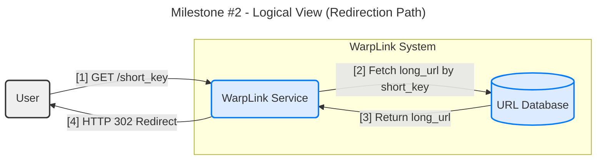
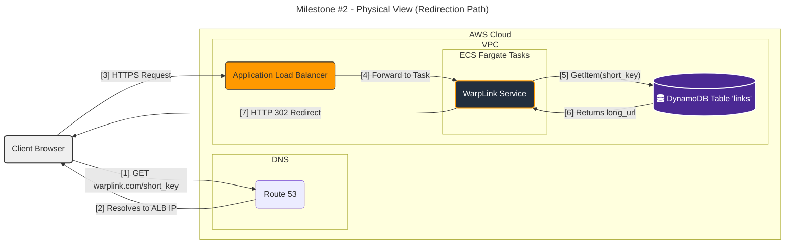

#### **Core Link Redirection (Read Path)**

**Problem:**
The system must provide a highly performant and reliable mechanism for the "read" operation, fulfilling requirement **FR2 (URL Redirection)**. A user accessing a short URL (e.g., `warplink.com/ABC1234`) must be redirected to the corresponding long URL. This path is extremely latency-sensitive and is expected to handle significantly higher traffic volume than the write path. The architecture must be designed to meet the non-functional requirement **NFR1 (p99 Redirection Latency < 50ms)**.

**Solution:**
The proposed architecture will handle the redirection path as a direct, optimized lookup flow.

1.  A user's request for a short URL will be directed via DNS to a high-availability entry point.
2.  The request will be routed to the `WarpLink Service`, which is responsible for the core redirection logic.
3.  The service will extract the `short_key` from the request path.
4.  It will perform a direct key-value lookup in the `URL Database` to retrieve the `long_url` associated with the `short_key`.
5.  Upon a successful lookup, the service will immediately issue an `HTTP 302 Found` redirect response to the user's client, with the `Location` header set to the `long_url`. If the key is not found, it will return an `HTTP 404 Not Found` error.

This design deliberately defers a dedicated caching layer to the next milestone, establishing a baseline performance model based on a direct database query.

**Trade-offs:**

*   **Direct Database Lookup (No Cache):**
    *   **Pros:** This represents the simplest possible architecture, leveraging the existing database. It allows us to establish a performance baseline and validates the speed of our chosen database (DynamoDB) for its primary access pattern.
    *   **Cons:** Every redirection request results in a database read. At massive scale, this will not be cost-effective and may introduce latency that risks violating our strict NFR. It creates a single point of dependency on the database's performance for every read.

*   **HTTP Status Code (302 vs. 301):**
    *   **Pros (302 Found - Temporary Redirect):** This is the correct choice. It instructs the client/browser to make a separate request to the destination URL for this instance but to use the short URL again in the future. This is critical because it allows us to collect analytics on every click.
    *   **Cons (301 Moved Permanently):** Using a 301 redirect would be a mistake. Browsers and intermediaries would cache the redirect permanently, causing future clicks to bypass our service entirely. This would make it impossible to change the destination URL or collect click analytics.

---

#### **Design the Architecture-as-Code (AaC)**

Here are the three artifacts for this milestone.

**Artifact 1: Logical View (C4 Component Diagram)**

This diagram shows the high-level software components and their interactions for the read/redirection path.

**Artifact 2: Physical View (Deployment Diagram)**

This diagram maps the logical components to specific AWS services for the redirection flow.

**Artifact 3: Component-to-Resource Mapping Table**

The physical resources are the same as in Milestone #1, but their roles in this specific interaction are highlighted.

| Logical Component | Physical Resource | Rationale (Why this technology for the Read Path?) |
| :--- | :--- | :--- |
| **WarpLink Service** | **AWS Fargate** | Fargate provides the compute layer to execute the lookup and redirect logic. Its container-based nature ensures the runtime environment is consistent and scalable to handle the high volume of read requests. |
| **URL Database** | **Amazon DynamoDB** | DynamoDB is the cornerstone of this design. Its `GetItem` operation provides the low-latency, single-digit millisecond lookup capability that is essential for meeting our performance NFR, even before caching is introduced. |
| **Request Entrypoint** | **AWS Route 53 & ALB** | Route 53 provides highly-available DNS resolution for the custom domain. The Application Load Balancer (ALB) is the direct entry point for traffic, capable of handling millions of requests per second and distributing the load efficiently across the Fargate tasks. |
