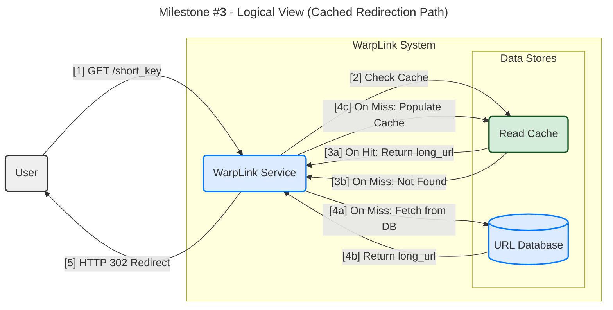
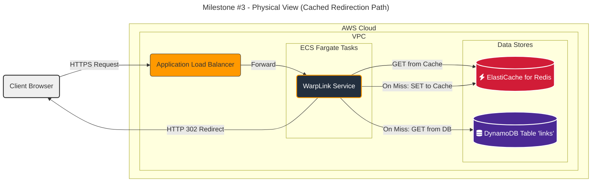

#### **High-Performance Read Cache**

**Problem:**
The current architecture from Issue #3 directs every redirection request to the primary database (DynamoDB). While DynamoDB is fast, this design has two major flaws at scale:
1.  **Latency:** It will fail to meet our stringent **NFR1 (p99 Redirection Latency < 50ms)** because every request incurs network latency to the database, even for the most popular, frequently accessed links.
2.  **Cost:** It is not cost-effective. The "read path" will have orders of magnitude more traffic than the "write path," and we would be paying for millions or billions of database read operations that could be served more cheaply.

**Solution:**
Introduce an in-memory caching layer between the `WarpLink Service` and the `URL Database` using the **cache-aside pattern**.

1.  When a redirection request for a `short_key` arrives at the `WarpLink Service`, it will **first** query the `Read Cache`.
2.  **Cache Hit:** If the `long_url` is found in the cache, it is returned immediately. This is the "fast path" that will serve the vast majority of requests for popular links.
3.  **Cache Miss:** If the `long_url` is not in the cache, the service will then proceed to query the `URL Database` as it did in the previous design.
4.  After retrieving the `long_url` from the database, the service will **populate the cache** with the `short_key` -> `long_url` mapping and set a reasonable **Time-To-Live (TTL)** (e.g., 24 hours).
5.  Finally, the service returns the `HTTP 302` redirect to the user.

This ensures that only the first request for an unpopular or new link hits the database, while all subsequent requests are served from the much faster in-memory cache.

**Trade-offs:**

*   **Introducing a Cache:**
    *   **Pros:** Dramatically reduces redirection latency, meeting our NFR. Massively reduces database read costs. Protects the database from "hotspot" keys (a single viral link getting millions of requests).
    *   **Cons:** Adds another component to the architecture, increasing complexity and a new potential point of failure. Introduces eventual consistency (a URL deleted from the DB could exist in the cache until its TTL expires), which is an acceptable trade-off for this use case.

*   **Caching Technology (Redis vs. Memcached):**
    *   **Amazon ElastiCache for Redis:**
        *   **Pros:** Extremely fast, provides robust high-availability and fault tolerance through replication and clustering, which is essential for this critical read path. It's a mature, feature-rich, and industry-standard choice.
        *   **Cons:** Slightly more configuration overhead than Memcached if not using the managed service.
    *   **Conclusion:** **Redis** is the clear winner because its high-availability features are non-negotiable for a service whose primary function (redirection) must remain online.

---

#### **Design the Architecture-as-Code (AaC)**

Here are the updated artifacts incorporating the new caching component.

**Artifact 1: Logical View (C4 Component Diagram)**

This diagram updates the read path to include the cache-aside logic.

**Artifact 2: Physical View (Deployment Diagram)**

This diagram adds Amazon ElastiCache for Redis to our physical architecture.

**Artifact 3: Component-to-Resource Mapping Table**

A new row is added for our caching component.

| Logical Component | Physical Resource | Rationale (Why this technology?) |
| :--- | :--- | :--- |
| **WarpLink Service** | AWS Fargate | (Unchanged) Executes the application logic, now including the cache-aside pattern. |
| **Read Cache** | **Amazon ElastiCache for Redis** | ElastiCache provides a fully managed, highly available, and low-latency in-memory data store. Redis is chosen for its robustness, industry adoption, and features like clustering and replication, which are critical for ensuring the redirection service remains fast and fault-tolerant. |
| **URL Database** | Amazon DynamoDB | (Unchanged) Acts as the persistent source of truth, now primarily handling cache misses, which significantly reduces its read load and operational cost. |
| **Request Entrypoint** | AWS Route 53 & ALB | (Unchanged) Provides the scalable, highly-available entry point for all redirection traffic. |
