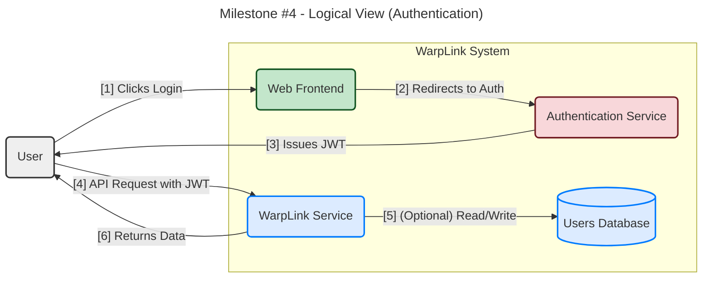
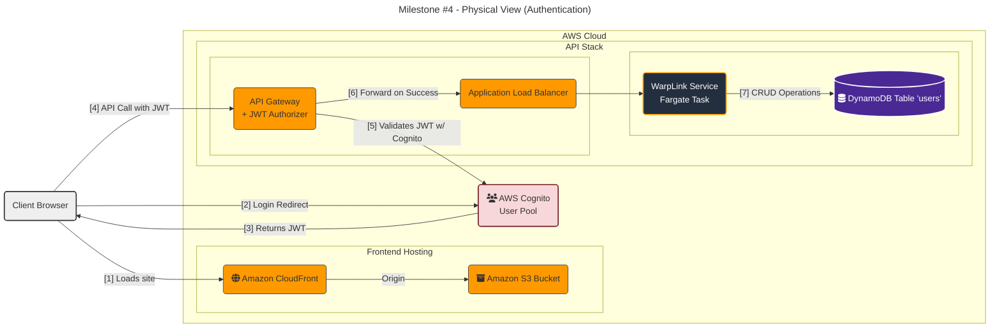

#### **User Authentication System**

**Problem:**
The system currently operates anonymously. To support features like custom aliases and link management, we must introduce the concept of a "user," fulfilling **FR5 (User Registration & Login)**. We need a secure, scalable, and standards-compliant way to manage user identities, handle registration and login, and secure API endpoints so that only authenticated users can access their own resources. Building this from scratch is complex and high-risk.

**Solution:**
We will implement a modern, token-based authentication system by delegating identity management to a managed service.

1.  A **Web Frontend** will serve as the user interface. When a user wants to log in or register, the frontend will redirect them to a hosted authentication page.
2.  A dedicated, managed **Authentication Service** will handle the entire user registration and login flow, including credential validation.
3.  Upon successful authentication, the service will issue a **JSON Web Token (JWT)** to the user's browser.
4.  The Web Frontend will store this JWT and include it in the `Authorization` header for all subsequent requests to protected API endpoints.
5.  An **Authorizer** at the API Gateway level will automatically inspect and validate the JWT on every incoming request *before* it reaches our application logic. If the token is valid, the request is passed through; otherwise, it is rejected with a `401 Unauthorized` error.

This design offloads the security-critical work of identity management to a specialized service, following industry best practices.

**Trade-offs:**

*   **Managed Identity Provider (vs. Build-Your-Own):**
    *   **Pros:** Drastically reduces security risks and development time. Provides out-of-the-box features like password policies, multi-factor authentication (MFA), and social logins. This is the standard best practice for modern applications.
    *   **Cons:** Creates a dependency on the chosen provider (e.g., AWS Cognito, Auth0), which can be considered a form of vendor lock-in.
    *   **Decision:** The security and development benefits far outweigh the cons. We will use a managed service.

*   **JWT Validation at the Edge (API Gateway vs. In-Service):**
    *   **Pros (API Gateway):** Highly efficient and secure. It rejects unauthenticated requests at the network edge, preventing them from consuming application resources. This simplifies the application code, as the service can trust that any request it receives has already been authenticated.
    *   **Cons (API Gateway):** Creates a tighter coupling between the application and the specific AWS infrastructure configuration.
    *   **Decision:** The security and efficiency gains of edge authorization are significant. We will perform validation at the API Gateway.

---

#### **3. Design the Architecture-as-Code (AaC)**

Here are the artifacts for the new authentication system.

**Artifact 1: Logical View (C4 Component Diagram)**

This diagram shows the new components and the authentication flow.

**Artifact 2: Physical View (Deployment Diagram)**

This diagram integrates AWS Cognito and a new DynamoDB table for user data.

**Artifact 3: Component-to-Resource Mapping Table**

New components are added to our table.

| Logical Component | Physical Resource | Rationale (Why this technology?) |
| :--- | :--- | :--- |
| **Web Frontend** | **Amazon S3 & CloudFront** | S3 provides durable, inexpensive hosting for static web assets (HTML, CSS, JS). CloudFront acts as a global CDN, ensuring fast load times for users worldwide and providing HTTPS. |
| **Authentication Service** | **AWS Cognito** | Cognito is a managed Identity Provider that handles all aspects of user management, including sign-up, sign-in, and token issuance. It directly integrates with API Gateway for JWT validation, making it the most seamless and secure choice within the AWS ecosystem. |
| **Users Database** | **Amazon DynamoDB** | A new DynamoDB table will store user profile information. It is chosen for the same reasons as the links table: it offers a scalable, low-latency, key-value store that is perfect for fetching user data by their unique ID. |
| **WarpLink Service** | AWS Fargate | (Unchanged) The service will now contain the business logic for authenticated endpoints, trusting that the API Gateway has already verified the user's identity. |
