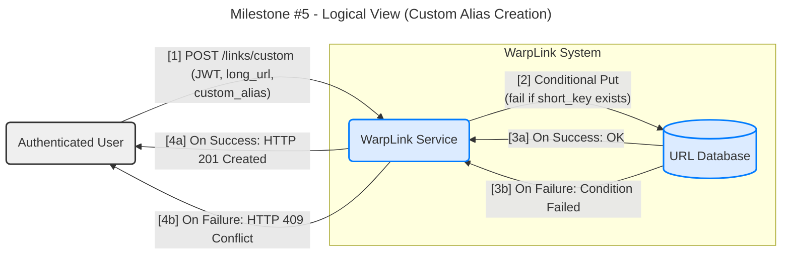
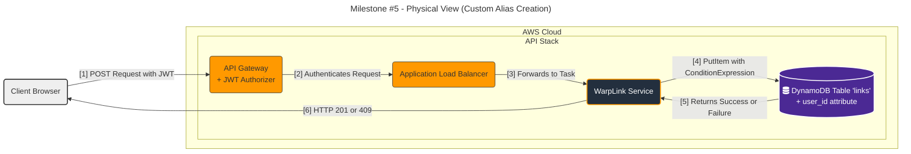

#### **Custom Alias Creation**

**Problem:**
To satisfy **FR3 (Custom URL Alias)**, registered users require the ability to create predictable, branded, and memorable short links (e.g., `warplink.com/my-event`) instead of relying on randomly generated keys. The system must prevent alias collisions (two users claiming the same alias) and associate the created link with the authenticated user for future management.

**Solution:**
The architecture will be extended to handle a new authenticated "write path" for creating links.

1.  A new, protected API endpoint (e.g., `POST /links/custom`) will be created. It will only be accessible to requests bearing a valid JWT, as enforced by the API Gateway Authorizer from Issue #7.
2.  The authenticated user will submit their `long_url`, the desired `custom_alias`, and their JWT.
3.  The `WarpLink Service` will receive the request. The user's unique ID (`user_id`) will be available from the validated JWT payload.
4.  The service will perform an **atomic, conditional write** operation to the `URL Database`. It will attempt to insert the new record (`short_key` = `custom_alias`) with an associated `user_id`, but only on the condition that an item with that `short_key` does not already exist.
5.  **Success:** If the write operation succeeds, it means the alias was available. The service returns an `HTTP 201 Created` response.
6.  **Failure:** If the write operation fails due to the condition check (the alias is already taken), the service returns an `HTTP 409 Conflict` error to inform the user that the alias is unavailable.

This approach is highly reliable and prevents race conditions where multiple users might attempt to claim the same alias simultaneously.

**Trade-offs:**

*   **Conflict Resolution (Conditional Write vs. Read-then-Write):**
    *   **Pros (Conditional Write):** This is the architecturally correct choice. Using the database's native conditional operation (e.g., DynamoDB's `ConditionExpression`) makes the check-and-set operation atomic. It is completely immune to race conditions and guarantees data integrity.
    *   **Cons (Read-then-Write):** A naive "check if exists, then write" approach is fundamentally flawed. It creates a time window between the read and the write where another process could claim the alias, leading to data corruption or silent failures. This approach is not acceptable for a reliable system.

*   **Schema Modification for Ownership:**
    *   **Pros:** Adding a `user_id` attribute to the `links` table is a necessary schema evolution. It establishes ownership, which is the foundation for all future user-specific features like "list my links" or "delete a link."
    *   **Cons:** This requires careful data modeling. Anonymous links (from Issue #1) will not have this attribute. This is easily handled by our NoSQL data model, which does not require all items to have the same attributes.

---

#### **Design the Architecture-as-Code (AaC)**

Here are the updated artifacts for this new feature.

**Artifact 1: Logical View (C4 Component Diagram)**

This diagram illustrates the new authenticated write path.

**Artifact 2: Physical View (Deployment Diagram)**

This diagram shows the new API endpoint protected by the Cognito Authorizer.

**Artifact 3: Component-to-Resource Mapping Table**

The `WarpLink Service` and `URL Database` have expanded responsibilities.

| Logical Component | Physical Resource | Rationale (Why this technology?) |
| :--- | :--- | :--- |
| **WarpLink Service** | AWS Fargate | (Expanded Role) The service logic now includes handling authenticated requests, parsing JWTs for `user_id`, and executing conditional database writes to handle alias conflict resolution. |
| **URL Database** | Amazon DynamoDB | (Expanded Role) The `links` table schema is evolved to include an optional `user_id` attribute to denote ownership. Its `PutItem` API with `ConditionExpression` is the critical technology that enables the atomic check-and-set operation, preventing race conditions. |
| **API Entrypoint** | Amazon API Gateway | (Expanded Role) A new route (`/links/custom`) is added and, crucially, protected by the existing JWT Authorizer, ensuring only authenticated users can access this feature. |
