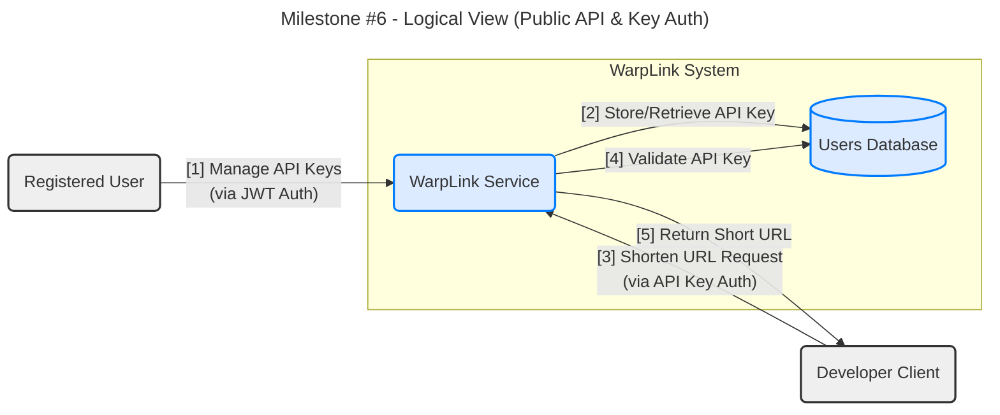
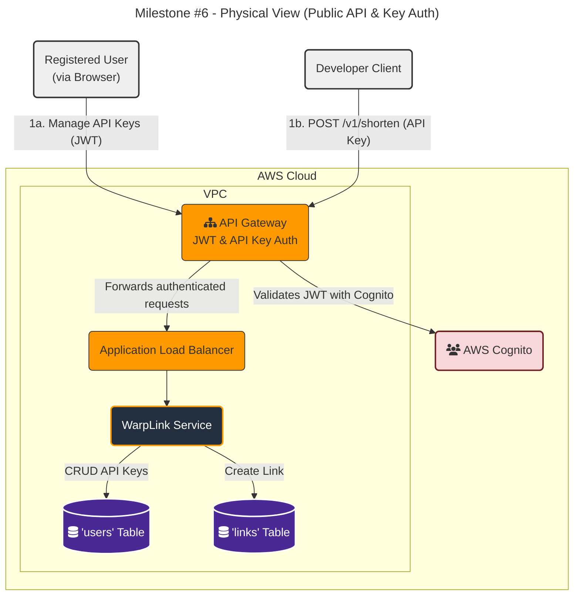

#### **Public API & Key Authentication**

**Problem:**
To satisfy **FR6 (API Key Generation)** and **FR7 (Public API Endpoint)**, third-party developers need programmatic access to our URL shortening functionality. This requires:
1.  A dedicated API endpoint that developers can call.
2.  A secure mechanism for developers to authenticate their requests, distinct from the browser-based JWT authentication used by the Web Frontend. This typically involves API keys.
3.  A way for authenticated users (developers) to generate and manage these API keys.

**Solution:**
We will introduce a new API endpoint specifically for external clients, secured by API keys.

1.  A **User API Key Management** endpoint will be added to the `WarpLink Service` to allow authenticated users (via JWT from Issue #4) to generate, list, and revoke their API keys. These API keys will be stored in the `Users Database` alongside other user metadata.
2.  A new, separate API Gateway endpoint will be established for the public API (e.g., `POST /v1/shorten`).
3.  This public API Gateway endpoint will use **API Key Authorization** to validate the `x-api-key` header in incoming requests.
4.  The API Gateway will look up the provided API key in an internal key store (often integrated with Usage Plans) and, upon successful validation, associate the request with a specific `user_id`.
5.  The request, along with the `user_id`, is then forwarded to the `WarpLink Service`.
6.  The `WarpLink Service` processes the request (e.g., generates a short URL) and returns the result to the API client.

This design provides a clear separation between internal user-facing APIs and external developer-facing APIs, each with its own appropriate authentication mechanism.

**Trade-offs:**

*   **API Key Authentication (vs. JWT for external clients):**
    *   **Pros (API Keys):** Simpler for server-to-server integration, less overhead than JWT for certain use cases, and easy to revoke. API Gateway provides native support for API keys and usage plans.
    *   **Cons (API Keys):** Less granular control than JWT claims, requires secure key management by the client (e.g., environmental variables, secrets manager).
    *   **Decision:** API Keys are a good fit for initial developer API access due to ease of implementation and native API Gateway support.

*   **Separate API Gateway for Public API:**
    *   **Pros:** Allows for distinct API policies, rate limits, and security configurations for the public API versus internal/web-facing APIs. Provides clear logical separation.
    *   **Cons:** Adds another API Gateway resource to manage. We can initially use different routes on the *same* API Gateway, and split it later if necessary. For now, we will assume different routes on the existing API Gateway.

---

#### **Design the Architecture-as-Code (AaC)**

Here are the updated artifacts for this new feature.

**Artifact 1: Logical View (C4 Component Diagram)**

This diagram shows the flow for generating and using API keys.

**Artifact 2: Physical View (Deployment Diagram)**

This diagram shows the new API Gateway configuration and the flow for developer clients.

**Artifact 3: Component-to-Resource Mapping Table**

The `API Gateway` and `WarpLink Service` have new responsibilities, and the `Users Database` stores API keys.

| Logical Component | Physical Resource | Rationale (Why this technology?) |
| :--- | :--- | :--- |
| **WarpLink Service** | AWS Fargate | (Expanded Role) Now includes API key generation/management logic and handles `POST /v1/shorten` requests for external clients. It uses the `user_id` passed from API Gateway for associating links. |
| **Users Database** | Amazon DynamoDB | (Expanded Role) Stores API keys and their associated `user_id` securely. Queries for API key management operations. |
| **Public API Endpoint** | **Amazon API Gateway (new route with API Key Auth)** | A new API Gateway resource (or existing with new route) configured for API Key authorization. It enables usage plans, throttling, and direct API key validation without hitting application code, crucial for external clients and **FR7**. |
| **API Key Management Endpoint** | Amazon API Gateway (existing route with JWT Authorizer) | (Expanded Role) An existing API Gateway route (e.g., `/user/api-keys`) protected by the JWT Authorizer (from Issue #4) allows authenticated users to securely interact with the API key management logic in the `WarpLink Service`, addressing **FR6**. |
