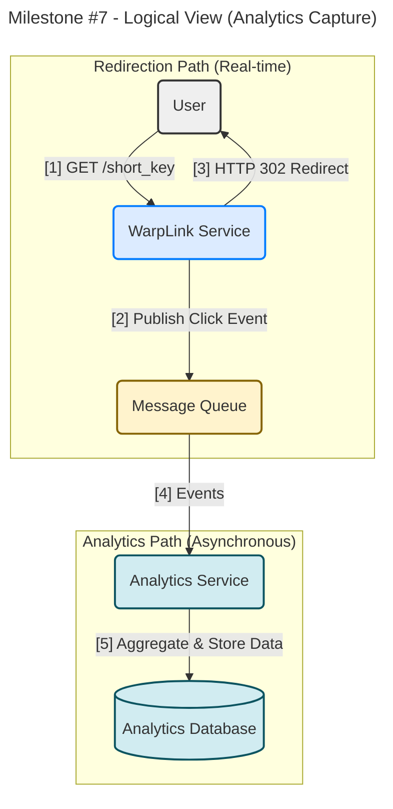
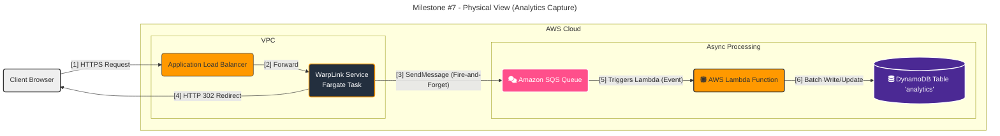

#### **Asynchronous Analytics Event Capture**

**Problem:**
The business needs to provide click analytics to registered users, fulfilling **FR4 (Basic Click Analytics)**. However, the redirection path is the most critical part of our service and is governed by a strict latency NFR. Any synchronous operation, such as writing to a database to log a click event, would add unacceptable latency to the redirection process, violating our core performance requirements.

**Solution:**
We will implement a decoupled, asynchronous event processing pipeline to capture analytics data without impacting redirection performance.

1.  When the `WarpLink Service` successfully resolves a `short_key` to a `long_url` (from either the cache or the database), it will perform a "fire-and-forget" operation.
2.  It will publish a small, lightweight "click event" message to a **Message Queue**. This message will contain context like the `short_key` and a `timestamp`.
3.  Crucially, the service will **not** wait for a response. It will immediately proceed to return the `HTTP 302` redirect to the user.
4.  A new, independent **Analytics Service** will act as a consumer for this queue. It will run as a background worker, completely separate from the request/response cycle.
5.  The Analytics Service will read messages from the queue (ideally in batches) and process them by aggregating the data. For example, it will increment a counter for the given `short_key` in a new, dedicated **Analytics Database**.

This "fire-and-forget" architecture ensures that the redirection path remains lightning-fast, while the analytics data is captured reliably and processed with eventual consistency.

**Trade-offs:**

*   **Asynchronous Processing (via Message Queue):**
    *   **Pros:** The only viable approach to meet the latency NFR. It decouples the systems, making the architecture more resilient (if the analytics DB is down, events are safely buffered in the queue). It allows the analytics processing system to scale independently of the redirection service.
    *   **Cons:** Introduces "eventual consistency"—analytics data will not be real-time, but will appear after a short processing delay (seconds to minutes), which is perfectly acceptable for this feature. It also adds more components to the architecture (queue, consumer service, analytics DB).

*   **Analytics Database (DynamoDB vs. Time-Series):**
    *   **Pros (DynamoDB):** Keeps our technology stack consistent. DynamoDB's atomic counters (`UpdateItem` operation) are well-suited for handling the high-write throughput of incrementing click counts. It's a scalable and cost-effective choice for this initial implementation.
    *   **Cons (DynamoDB):** More complex analytical queries (e.g., "clicks per day over the last 30 days") can be less efficient than with a purpose-built time-series database. This is an acceptable trade-off for our V1 analytics feature.

---

#### **Design the Architecture-as-Code (AaC)**

Here are the updated artifacts incorporating the analytics pipeline.

**Artifact 1: Logical View (C4 Component Diagram)**

This diagram shows the new asynchronous flow for capturing analytics.

**Artifact 2: Physical View (Deployment Diagram)**

This diagram introduces Amazon SQS and AWS Lambda to our physical architecture.

**Artifact 3: Component-to-Resource Mapping Table**

New components are added for our asynchronous pipeline.

| Logical Component | Physical Resource | Rationale (Why this technology?) |
| :--- | :--- | :--- |
| **Message Queue** | **Amazon SQS** | SQS (Simple Queue Service) is the ideal choice for decoupling services. It is fully managed, extremely scalable, and provides a durable buffer for events, ensuring click data is not lost even if the downstream analytics service is temporarily unavailable. |
| **Analytics Service** | **AWS Lambda** | Lambda is the perfect compute model for this task. It's event-driven and can be configured to trigger directly from an SQS queue. It scales automatically from zero to thousands of invocations based on the message volume, making it highly cost-effective and operationally efficient. |
| **Analytics Database** | **Amazon DynamoDB** | A new DynamoDB table is created for analytics data. It can handle the high-volume, high-velocity writes from the Lambda function and is optimized for the simple aggregation patterns (e.g., atomic counters) needed for basic click tracking. |
| **WarpLink Service** | AWS Fargate | (Expanded Role) The service's responsibility is minimally expanded to include a single, non-blocking "SendMessage" API call to SQS during the redirection process. |
